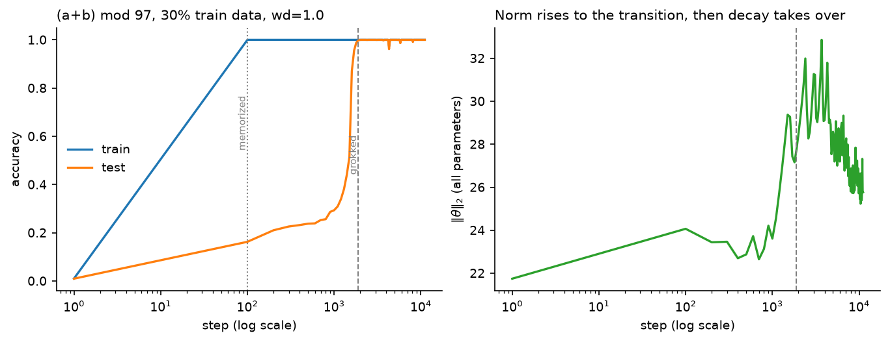
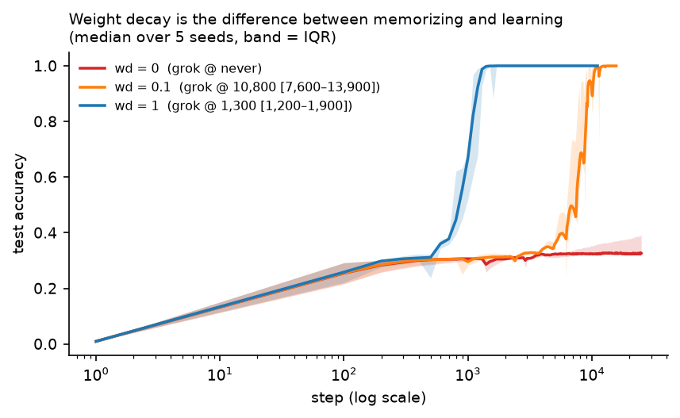
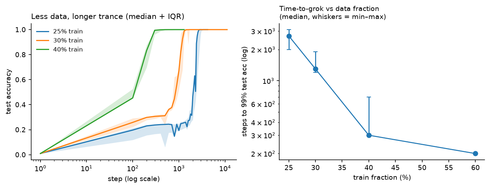
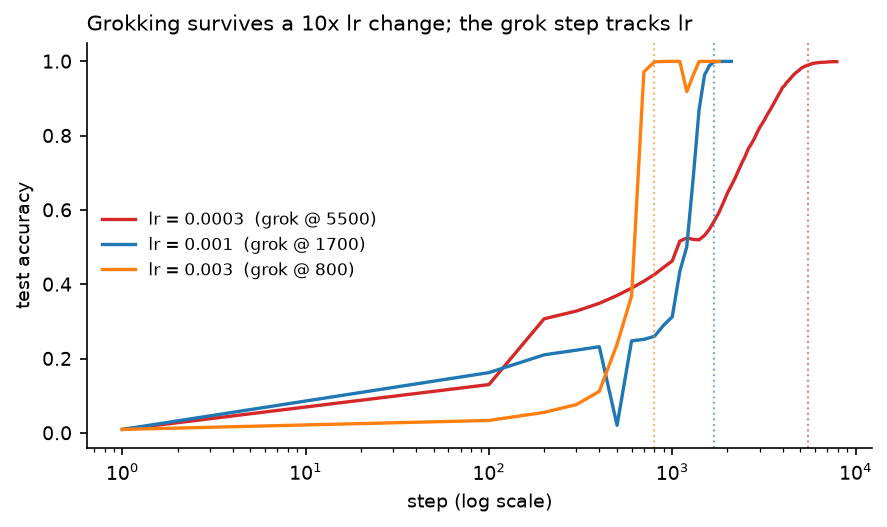
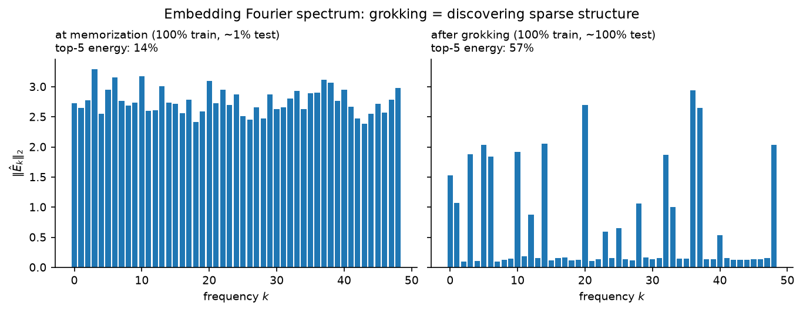
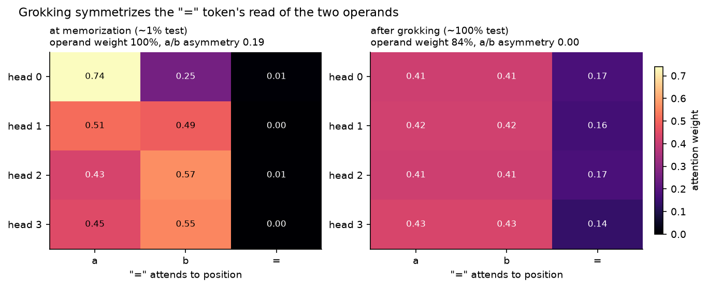
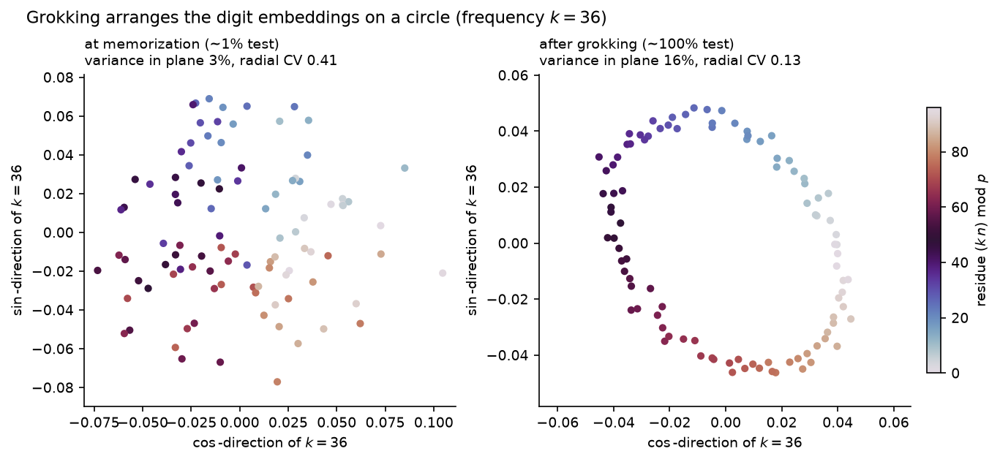

# grokking-transformer


A decoder-only transformer implemented from scratch (the attention arithmetic
is written out and tested against PyTorch's fused reference) and used to
reproduce and dissect **grokking**: on modular addition, the model reaches
100% *training* accuracy at step 100 and stays at ~20% *test* accuracy until
step ~1,900 — then jumps to 100%. The repo measures what controls the delay
(weight decay, data fraction) and inspects what changes inside the network
(weight norm, the Fourier structure of its embeddings) when it finally
generalizes.



## Problem

Train a 223k-parameter transformer on 30% of all pairs $(a, b)$ to predict
$(a + b) \bmod 97$, supervised at the "=" position of the sequence
$[a, b, =]$. The dataset is noiseless and exhaustive, so test accuracy has an
unambiguous meaning: either the network recovered *the algorithm*, or it
memorized. With ~2.8k training examples against 223k parameters,
memorization is easy — the scientific question is why the network ever
prefers the general solution, and what schedule it finds it on.

The theory ([`theory/notes.md`](theory/notes.md)) covers the attention
derivation, the frequency-space algorithm for modular addition (via the DFT
delta identity $\sum_{k=0}^{p-1} \cos(2\pi k n / p) = p\,\delta_{n \equiv 0}$
and the angle-addition identities), and the norm/efficiency account of *why*
generalization is delayed rather than absent.

## What's implemented

| Piece | Where | Verified how |
|---|---|---|
| Causal multi-head attention, by hand | [`grokking/model.py`](grokking/model.py) | equal to `F.scaled_dot_product_attention` given the same weights; zero attention mass on the future; changing a future token provably cannot change past logits |
| LayerNorm, by hand | [`grokking/model.py`](grokking/model.py) | equal to `F.layer_norm` |
| Modular-addition dataset + splits | [`grokking/data.py`](grokking/data.py) | exhaustiveness, label correctness, disjoint & deterministic splits |
| Full-batch AdamW harness | [`grokking/train.py`](grokking/train.py) | end-to-end memorization sanity run on CPU |
| Sweeps / plots / Fourier analysis | [`experiments/`](experiments/) | all figures regenerate from committed CSV logs |

Design choices that matter for the science: **full batch** (no minibatch
noise confound), **AdamW's decoupled decay** (the regularizer under study —
L2-through-Adam is a different object), **no dropout** (weight decay must be
the only regularizer), and **two checkpoints per run** (memorization point
and final) so "before vs after" is a comparison within a single trajectory.

## Results

All runs: $p = 97$, 1 layer, $d_{\text{model}} = 128$, 4 heads, lr $10^{-3}$,
seed 0, full-batch AdamW. Logs in [`runs/`](runs/), regenerate figures with
`python experiments/plots.py`.

### 1. Weight decay controls whether — and when — grokking happens

30% training data, three values of weight decay:

| weight decay | memorized (100% train) | grokked (99% test) | delay |
|---|---|---|---|
| 0.0 | step 100 | **never** (25k-step budget) | ∞ |
| 0.1 | step 100 | step 13,900 | 139× |
| 1.0 | step 100 | step 1,900 | 19× |



The wd = 0 control memorizes identically fast, then stays memorized — test
accuracy creeps to only ~28% by step 25k (some implicit regularization
exists, but no transition within budget). This is the cleanest evidence in
the repo that the delayed generalization is *driven by the regularizer*, not
by more gradient steps on the task loss: after step ~100 the training loss
is nearly zero and almost all subsequent change in test accuracy is the
norm-pressure term reorganizing the network's internals.

### 2. Less data, longer trance

Weight decay 1.0, four training fractions:

| train fraction | grokked at step | delay over memorization |
|---|---|---|
| 25% | 3,100 | 31× |
| 30% | 1,900 | 19× |
| 40% | 700 | 7× |
| 60% | 200 | 2× |



Monotone, roughly log-linear: as the training set shrinks, memorization gets
relatively cheaper (fewer pairs to store) while the general circuit's cost is
fixed — so the phase in which memorization dominates stretches. At 60% data
the "delay" nearly vanishes and grokking degenerates into ordinary learning;
grokking is a *small-data* phenomenon.

### 3. Robustness: grokking survives a 10× learning-rate change

Is the grok time an artifact of one tuned learning rate? Rerunning the main
config (30%, wd = 1, seed 0) at lr spanning an order of magnitude
([`lr_sweep.py`](experiments/lr_sweep.py)):

| lr | memorized at | grokked at | delay |
|---|---|---|---|
| 3e-4 | 200 | 5,500 | 27× |
| 1e-3 | 100 | 1,700 | 17× |
| 3e-3 | 100 | 800 | 8× |



The phenomenon is robust — the network memorizes fast and generalizes late at
every learning rate — but the grok *step* is not a physical constant: it
scales roughly inversely with lr (a 10× larger lr groks ~7× sooner), because
the grok step counts optimizer steps, and a larger step covers more of the
same path per iteration. Memorization is already near-instant at all three
lrs, so the delay multiple shrinks as lr grows while never vanishing. The
takeaway for the rest of this repo: grok steps are only comparable **at fixed
lr** (all other sweeps here hold lr = 1e-3), and "1,900 steps" is a property
of the optimizer schedule, not just the task.

### 4. What changes inside: norm and Fourier structure

Two measurements on the main run (30%, wd = 1), same seed, same trajectory:

- **Weight norm** (right panel of the hero figure): rises while the
  loss-gradient dominates, peaks around the transition, then falls once
  train loss is pinned at ~0 and decay is the only force left. (Our first
  version of this run early-stopped 500 steps after grokking and *missed*
  the decline — the run was extended to 11k steps precisely so the plot
  shows the dynamics rather than an artifact of the stopping rule.)
- **Embedding Fourier spectrum** — the algorithm's fingerprint. At the
  memorization checkpoint, spectral energy is spread across all 48
  frequencies (top-5 share: **13.6%**, indistinguishable from unstructured).
  At the final checkpoint, five frequencies ($k = 5, 14, 20, 36, 37$)
  dominate with a top-5 share of **56.7%**:



Consistent with Nanda et al.'s progress-measures picture: the general
circuit is sparse in frequency space, and it keeps *consolidating after*
the accuracy jump (our early-stopped checkpoint showed 40%; 3k steps later,
57%) — the "sudden" jump is a thresholding artifact of accuracy, not a
discontinuity in the weights.

### Appendix: attention and embedding geometry

The same before/after story is visible in two more read-outs of the
committed checkpoints (both regenerated by `reproduce_figures.py`, no
retraining):

- **Attention pattern** ([`attention_pattern.py`](experiments/attention_pattern.py)).
  The "=" token — where the answer is written — spends ~all of its attention
  on the two operand positions `a` and `b` in *both* checkpoints (it has
  nothing else to read, and the causal mask forbids looking ahead). What
  grokking changes is the *symmetry*: the grokked heads split their operand
  attention almost exactly evenly (per-head $|A_{=\to a} - A_{=\to b}|$ falls
  from **0.19** to **0.00**), matching the commutativity $a + b = b + a$ that
  the general algorithm must respect, whereas the memorizing heads are
  lopsided (one puts 0.74 on `a`, 0.25 on `b`).

  

- **Embedding ring** ([`embedding_circle.py`](experiments/embedding_circle.py)).
  Projected onto the dominant frequency's (cos, sin) plane, the grokked digit
  embeddings trace a clean circle (radial CV 0.13, up from a diffuse 0.41 at
  memorization) — the geometric face of the Fourier sparsification above.

  

## Reproduce

```bash
python -m venv .venv && source .venv/bin/activate
pip install -r requirements.txt && pip install -e .
pytest                              # 15 tests
python experiments/run_sweep.py     # 6 runs, ~30 min on Apple Silicon (MPS) — resumable
python experiments/plots.py         # figures from committed CSVs (no training needed)
python experiments/fourier.py       # needs the checkpoints from run_sweep.py
```

Committed CSV logs mean the figures are reproducible without retraining;
checkpoints (`runs/*.pt`) are gitignored.

## Honest limitations

- **One seed per configuration.** Time-to-grok varies across seeds; the
  tables show trends, not error bars. The wd = 0 vs wd = 1 contrast and the
  monotonicity in data fraction are robust in the literature.
- **Architecture differs from Nanda et al.** (we use LayerNorm + GELU;
  their interp model was LN-free ReLU), which is likely part of why our
  final spectrum is sparse-but-not-extremely-sparse rather than >90%
  concentrated. Training far past the transition sharpens it.
- **Thresholds are conventions** (99.9% "memorized", 99% "grokked"); the
  underlying weight-space transition is gradual.

## Next

- Multi-seed error bars on time-to-grok; wd × frac interaction surface.
- Progress measures *during* training (restricted/excluded loss à la Nanda)
  rather than two-checkpoint snapshots.
- Other operations: subtraction and multiplication grok; division's
  structure differs — a natural comparative study.

## References

Power et al. (2022) arXiv:2201.02177 (grokking); Nanda et al. (2023) ICLR,
arXiv:2301.05217 (Fourier circuit, progress measures); Liu et al. (2023)
"Omnigrok", ICLR (norm dynamics); Varma et al. (2023) arXiv:2309.02390
(circuit efficiency); Vaswani et al. (2017) (transformer); Loshchilov &
Hutter (2019) (AdamW). Roles and derivations in
[`theory/notes.md`](theory/notes.md).

## Provenance

Built as a study resource: implemented from scratch with AI assistance
(Claude), with the theory written out in [`theory/notes.md`](theory/notes.md)
and every structural claim about the implementation pinned by a test.
MIT license.

*Suggested GitHub topics:* `grokking` `transformer` `mechanistic-interpretability`
`deep-learning` `pytorch` `from-scratch` `attention`
