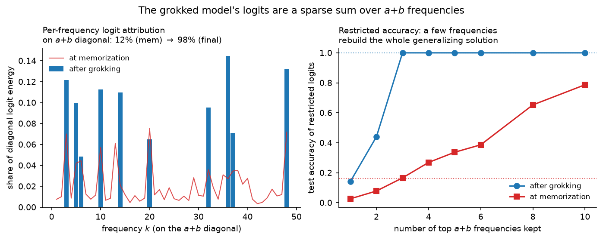
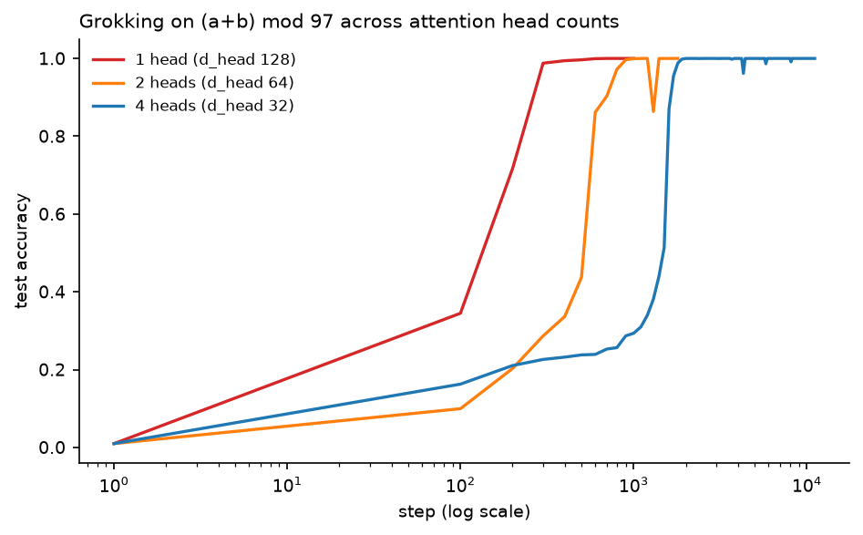
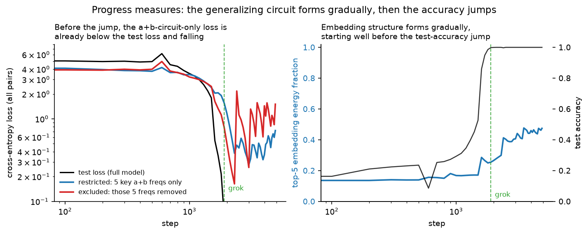

# grokking-transformer


A decoder-only transformer implemented from scratch (the attention arithmetic
is written out and tested against PyTorch's fused reference) and used to
reproduce and dissect **grokking**: on modular addition, the model reaches
100% *training* accuracy at step 100 and stays near ~20% *test* accuracy for
~1,300 steps (median over 5 seeds) — then jumps to 100%. The repo measures
what controls the delay
(weight decay, data fraction) and inspects what changes inside the network
(weight norm, the Fourier structure of its embeddings) when it finally
generalizes.


## Problem

Train a 223k-parameter transformer on 30% of all pairs $(a, b)$ to predict
$(a + b) \bmod 97$, supervised at the "=" position of the sequence
$[a, b, =]$. The dataset is noiseless and exhaustive, so test accuracy has an
unambiguous meaning: either the network recovered *the algorithm*, or it
memorized. With ~2.8k training examples against 223k parameters,
memorization is easy — the scientific question is why the network ever
prefers the general solution, and what schedule it finds it on.

The theory ([`theory/notes.md`](theory/notes.md)) covers the attention
derivation, the frequency-space algorithm for modular addition (via the DFT
delta identity $\sum_{k=0}^{p-1} \cos(2\pi k n / p) = p\,\delta_{n \equiv 0}$
and the angle-addition identities), and the norm/efficiency account of *why*
generalization is delayed rather than absent.

## What's implemented

| Piece | Where | Verified how |
|---|---|---|
| Causal multi-head attention, by hand | [`grokking/model.py`](grokking/model.py) | equal to `F.scaled_dot_product_attention` given the same weights; zero attention mass on the future; changing a future token provably cannot change past logits |
| LayerNorm, by hand | [`grokking/model.py`](grokking/model.py) | equal to `F.layer_norm` |
| Modular-addition dataset + splits | [`grokking/data.py`](grokking/data.py) | exhaustiveness, label correctness, disjoint & deterministic splits |
| Full-batch AdamW harness | [`grokking/train.py`](grokking/train.py) | end-to-end memorization sanity run on CPU |
| Sweeps / plots / Fourier analysis | [`experiments/`](experiments/) | all figures regenerate from committed CSV logs |

Design choices that matter for the science: **full batch** (no minibatch
noise confound), **AdamW's decoupled decay** (the regularizer under study —
L2-through-Adam is a different object), **no dropout by default** (so weight
decay is the only regularizer in the main runs — though dropout is an
available knob, used only for the regularizer control in §6), and **two
checkpoints per run** (memorization point
and final) so "before vs after" is a comparison within a single trajectory.

## Results

All runs: $p = 97$, 1 layer, $d_{\text{model}} = 128$, 4 heads, lr $10^{-3}$,
full-batch AdamW. The weight-decay and data-fraction sweeps below run **5 seeds
per cell** and report the median with the min–max range; the mechanistic
single-run analyses (§3–6 and the Fourier/attention/embedding read-outs) stay
on seed 0, which is what the hero figure shows. Logs in [`runs/`](runs/),
regenerate figures with `python experiments/plots.py`.

### 1. Weight decay controls whether — and when — grokking happens

30% training data, three values of weight decay (median grok step over 5 seeds,
`[min–max]`; memorization is at step 100 in every seed):

| weight decay | memorized (100% train) | grokked (99% test), median [range] | delay |
|---|---|---|---|
| 0.0 | step 100 | **never** (25k budget, all 5 seeds) | ∞ |
| 0.1 | step 100 | 10,800 [7,600–13,900] | 108× |
| 1.0 | step 100 | 1,300 [1,200–1,900] | 13× |


The wd = 0 control memorizes identically fast, then stays memorized — no seed
transitions within budget (final test accuracy 0.29–0.42 across the five, some
implicit regularization but no grok). The seed spread never comes close to
closing the gap between the three cells: even the slowest wd = 1 seed (1,900)
groks before the *fastest* wd = 0.1 seed (7,600), so weight decay's ordering is
not a seed artifact. This is the cleanest evidence in the repo that the delayed
generalization is *driven by the regularizer*, not by more gradient steps on
the task loss: after step ~100 the training loss
is nearly zero and almost all subsequent change in test accuracy is the
norm-pressure term reorganizing the network's internals.

### 2. Less data, longer trance

Weight decay 1.0, four training fractions (median grok step over 5 seeds,
`[min–max]`; 60% is a single-seed context point):

| train fraction | grokked at step, median [range] | delay over memorization |
|---|---|---|
| 25% | 2,700 [2,000–3,100] | 27× |
| 30% | 1,300 [1,200–1,900] | 13× |
| 40% | 300 [300–700] | 3× |
| 60% | 200 (1 seed) | 2× |


Monotone in the medians, roughly log-linear: as the training set shrinks,
memorization gets
relatively cheaper (fewer pairs to store) while the general circuit's cost is
fixed — so the phase in which memorization dominates stretches. At 60% data
the "delay" nearly vanishes and grokking degenerates into ordinary learning;
grokking is a *small-data* phenomenon.

### 3. Robustness: grokking survives a 10× learning-rate change

Is the grok time an artifact of one tuned learning rate? Rerunning the main
config (30%, wd = 1, seed 0) at lr spanning an order of magnitude
([`lr_sweep.py`](experiments/lr_sweep.py)):

| lr | memorized at | grokked at | delay |
|---|---|---|---|
| 3e-4 | 200 | 5,500 | 27× |
| 1e-3 | 100 | 1,700 | 17× |
| 3e-3 | 100 | 800 | 8× |


The phenomenon is robust — the network memorizes fast and generalizes late at
every learning rate — but the grok *step* is not a physical constant: it
scales roughly inversely with lr (a 10× larger lr groks ~7× sooner), because
the grok step counts optimizer steps, and a larger step covers more of the
same path per iteration. Memorization is already near-instant at all three
lrs, so the delay multiple shrinks as lr grows while never vanishing. The
takeaway for the rest of this repo: grok steps are only comparable **at fixed
lr** (all other sweeps here hold lr = 1e-3), and "1,900 steps" is a property
of the optimizer schedule, not just the task.

### 4. Does the delay grow with the modulus? (No — data size wins)

Every run above uses $p = 97$. Repeating the main configuration (30%,
wd = 1, seed 0, same lr) at a larger prime $p = 113$ changes two things at
once: more residue classes and Fourier frequencies for the circuit to
represent (harder), but 30% of the larger $p^2$ grid is more absolute
training pairs (easier). [`modulus_scaling.py`](experiments/modulus_scaling.py):

| $p$ | train pairs (30%) | memorized at | grokked at | delay |
|---|---|---|---|---|
| 97 | 2,823 | step 100 | step 1,900 | 19× |
| 113 | 3,831 | step 100 | **step 600** | 6× |

The larger modulus groks **sooner**, not later: memorization is instant in
both, but generalization arrives 3× earlier at $p = 113$. The absolute
training-set size dominates — this is the same lever as §2 (grokking is a
small-data phenomenon), and 3,831 pairs sit further from the critical
fraction than 2,823 do. The transition is also softer at $p = 113$: test
accuracy is already 29% at the memorization point and climbs steadily, rather
than sitting near chance through a long plateau. So "time-to-grok" is not a
clean increasing function of $p$; at fixed data *fraction*, the data-quantity
effect wins on this axis. (One seed, one extra modulus — a direction, not a
scaling law.)

### 5. What changes inside: norm and Fourier structure

Two measurements on the main run (30%, wd = 1), same seed, same trajectory:

- **Weight norm** (right panel of the hero figure): rises while the
  loss-gradient dominates, peaks around the transition, then falls once
  train loss is pinned at ~0 and decay is the only force left. (Our first
  version of this run early-stopped 500 steps after grokking and *missed*
  the decline — the run was extended to 11k steps precisely so the plot
  shows the dynamics rather than an artifact of the stopping rule.)
- **Embedding Fourier spectrum** — the algorithm's fingerprint. At the
  memorization checkpoint, spectral energy is spread across all 48
  frequencies (top-5 share: **13.6%**, indistinguishable from unstructured).
  At the final checkpoint, five frequencies ($k = 5, 14, 20, 36, 37$)
  dominate with a top-5 share of **56.7%**:


Consistent with Nanda et al.'s progress-measures picture: the general
circuit is sparse in frequency space, and it keeps *consolidating after*
the accuracy jump (our early-stopped checkpoint showed 40%; 3k steps later,
57%) — the "sudden" jump is a thresholding artifact of accuracy, not a
discontinuity in the weights.

### 6. Is it the norm specifically, or any regularizer? (A dropout control)

Section 5 shows weight decay generalizing by pulling the weight norm down, and
the Omnigrok picture (Liu et al. 2023) makes *norm reduction* the mechanism.
That invites a control: swap weight decay for **dropout** — a regularizer that
does not target the norm at all — holding frac = 0.30, seed, and lr fixed
(**dropout 0.1, weight decay 0**).

| regularizer | memorized | grokked | final test acc |
|---|---|---|---|
| none (wd 0) | step 100 | never | 0.29 |
| **dropout 0.1** (wd 0) | step 200 | **step 3500** | **0.999** |
| weight decay 1.0 | step 100 | step 1900 | 1.00 |


Dropout groks — so it is **not** weight decay specifically that is required.
But the mechanism is visibly different: weight decay generalizes while driving
the norm *down* (section 5), whereas under dropout the norm **rises
monotonically** the entire time (21 → 55) and the model generalizes anyway.
Norm reduction is therefore *sufficient but not necessary* here; a regularizer
that instead penalizes co-adapted, memorization-friendly features reaches the
same generalizing circuit by a different route. What the two share — and what
the unregularized run lacks — is simply *pressure against the pure-memorization
solution*, not a particular way of applying it.

### 7. *Where* does the norm pressure need to be? (Not the embeddings)

Section 6 says pressure against memorization is what matters. But "the weight
norm" is the norm of *every* parameter — so does the decay need to act on the
**embeddings** (the token/position tables, where the Fourier structure lives),
on the **rest** of the network (attention + MLP + unembed, which read that
structure out), or on both at once? This ablation holds the main config fixed
(frac 0.30, wd 1.0, seed 0) and changes only *which* parameters weight decay is
applied to; the untargeted group trains at wd 0.

| weight-decay scope | memorized | grokked (99% test) | final test |
|---|---|---|---|
| decay everything (main) | step 100 | step 1900 | 1.00 |
| decay **non-embeddings only** | step 100 | **step 1800** | 1.00 |
| decay **embeddings only** | step 100 | **never** (15k steps) | 0.36 |


The pressure that matters is on the **non-embedding** weights. Decaying them
alone reproduces the full-decay run almost exactly (grok step 1800 vs 1900, the
two curves overlap). Decaying only the embeddings does essentially nothing: the
model never groks in 15k steps, because the rest of the network — now
unconstrained — keeps its large memorization weights, and the total norm climbs
without bound ($\|\theta\|$ balloons from 21 to **287**, the green curve, while
both grokking runs hold it near 20–40). Weight decay drives grokking by
shrinking the *readout* circuit's parameters; pinning the embeddings' norm is
neither sufficient nor the operative lever. (The embeddings supply the Fourier
basis, but their *scale* is not what memorization exploits.)

### 8. The generalizing solution is a sparse sum over frequencies (logit attribution)

Sections 5–7 look at what grokking does to the *weights*. This one reads the
model's actual **output**. If the network has learned the algorithm, its logits
should (a) depend on $a+b$ and (b) be built from only a few frequencies — the
angle-addition circuit $\text{logit}(a,b,c)\approx\sum_k A_k\cos\big(\tfrac{2\pi
k}{p}(a+b-c)\big)$. Both are directly measurable on the committed checkpoints
([`logit_attribution.py`](experiments/logit_attribution.py)): 2D-Fourier-transform
the logit tensor $L[a,b,c]$ over the two input axes, and a function of $a+b$ puts
all its energy on the diagonal $k_a=k_b$.

| checkpoint | logit energy on the $a{+}b$ diagonal | top **3** frequencies rebuild test acc |
|---|---|---|
| at memorization | **12%** (diffuse) | 0.17 |
| after grokking | **98%** (it computes the sum) | **1.00** |



Keeping only the top-$m$ diagonal frequencies and inverse-transforming rebuilds
the logits from *just those frequencies* — a static, hand-built version of Nanda
et al.'s **restricted loss** (§10 makes it a training trajectory). Three frequencies, $k\in\{3,36,48\}$, rebuild the grokked model's
**full 100%** test accuracy. Two further things fall out. The dominant logit
frequencies substantially overlap the dominant *embedding* frequencies (§5) —
the sparse basis the embeddings carry is the basis the logits are written in.
And projecting the **memorization** checkpoint's logits onto the clean $a+b$
subspace recovers far more test accuracy (top-10 freqs → 0.79) than the raw
memorizing model expresses (0.16): the generalizing circuit is already forming,
drowned out by per-pair memorization, *before* the test-accuracy jump — the
same "gradual then sudden" story the progress measures will make quantitative.

### 9. Does grokking need multiple heads? (No — one wide head groks fastest)

The main runs use 4 heads. But modular addition has a single known mechanism —
embed each input on a circle, add the angles, read off the sum by interference
(§8) — and nothing in it obviously needs the representation split across heads.
Holding the main config fixed (frac 0.30, wd 1.0, seed 0) and varying only
`n_heads` with `d_model` pinned at 128 (so head width tracks the count):

| `n_heads` | `d_head` | memorize | grok | final test |
|---|---|---|---|---|
| 1 | 128 | 100 | **400** | 1.000 |
| 2 | 64 | 100 | 900 | 1.000 |
| 4 | 32 | 100 | 1900 | 1.000 |



All three grok to 100% — so grokking on this task does **not** require multiple
heads; a single head is enough. And at seed 0 the grok delay *increases*
monotonically with head count: the single wide head (`d_head` 128) forms the
circuit fastest, and splitting the same 128 dimensions into more, narrower heads
slows the transition roughly 2× per doubling. The likely reason is that the
one-head circuit lives in a single attention pattern, while more heads must
coordinate the same computation across a partitioned residual stream. **Caveat**:
this is one seed, and the grok time has real seed spread (the 4-head main run is
1300 [1200–1900] over five seeds, §1); the ~5× span here exceeds that band so the
ordering is likely genuine, but a full multi-seed sweep — not run here — is what
would nail it. Reuses the committed 4-head main run; only the 1-/2-head runs are
computed ([`head_count.py`](experiments/head_count.py)).

### 10. The circuit forms *gradually*, before the jump (progress measures)

Sections 5 and 8 read the Fourier structure of *two* checkpoints (memorization
and final). This section makes it a **trajectory**: rerun the main config with
per-eval instrumentation and log Nanda et al.'s progress measures at every step,
watching the generalizing circuit form continuously under the flat test-accuracy
plateau. The instrumentation is a one-line `on_eval` hook into the trainer that
snapshots the (tiny) model at each eval; the key `a+b` frequencies are then read
off the *final* model (here $k\in\{5,14,20,36,38\}$) and held fixed across the
trajectory, so we track the same circuit forming rather than a moving target.
Two of the measures ablate the logits in the 2D-Fourier basis of §8:

- **restricted loss** — keep *only* those 5 key frequencies of $a+b$;
- **excluded loss** — remove exactly those 5 (all else kept).

Both are computed over all $p^2$ pairs — mechanism measures, decoupled from the
train/test split ([`progress_measures.py`](experiments/progress_measures.py)).



The read-out (main config, seed 0, CPU rerun; grok at ~1900):

- **The generalizing circuit is the better predictor *before* the jump.** At the
  memorization point (step 100), the full model's **test loss is 5.03** yet the
  **restricted loss is 4.10** — projecting onto just the 5 key frequencies is
  already ~0.9 nats *better* than the whole memorizing model, and it keeps
  falling smoothly all through the plateau (to 2.6 by step 1400) while test
  accuracy is still stuck near 15%. The circuit is being built continuously; the
  accuracy jump is when it finally dominates.
- **Embedding structure rises gradually**, from 14% of the spectral energy in
  its top 5 frequencies at memorization to ~47% by the end, beginning to climb
  before the accuracy step (right panel) — the same sparsification §5 sees
  between two checkpoints, now resolved in time.
- **The model genuinely depends on those frequencies.** After grokking the full
  test loss reaches ~$10^{-2}$, but the *excluded* loss stays near 1 — remove the
  5 key frequencies and the solution collapses.

This is the quantitative version of §8's static hint ("the circuit is already
forming under the memorization, before the test-accuracy jump"). Because the
trajectory CSV is committed, the figure reproduces with no retraining.

### Appendix: attention and embedding geometry

The same before/after story is visible in two more read-outs of the
committed checkpoints (both regenerated by `reproduce_figures.py`, no
retraining):

- **Attention pattern** ([`attention_pattern.py`](experiments/attention_pattern.py)).
  The "=" token — where the answer is written — spends ~all of its attention
  on the two operand positions `a` and `b` in *both* checkpoints (it has
  nothing else to read, and the causal mask forbids looking ahead). What
  grokking changes is the *symmetry*: the grokked heads split their operand
  attention almost exactly evenly (per-head $|A_{=\to a} - A_{=\to b}|$ falls
  from **0.19** to **0.00**), matching the commutativity $a + b = b + a$ that
  the general algorithm must respect, whereas the memorizing heads are
  lopsided (one puts 0.74 on `a`, 0.25 on `b`).

  

- **Embedding ring** ([`embedding_circle.py`](experiments/embedding_circle.py)).
  Projected onto the dominant frequency's (cos, sin) plane, the grokked digit
  embeddings trace a clean circle (radial CV 0.13, up from a diffuse 0.41 at
  memorization) — the geometric face of the Fourier sparsification above.

  

## Reproduce

```bash
python -m venv .venv && source .venv/bin/activate
pip install -r requirements.txt && pip install -e .
pytest                              # 39 tests
python experiments/run_sweep.py     # 26 runs (5 seeds x 5 cells + 1), ~2 h on Apple Silicon (MPS) — resumable
python experiments/plots.py         # figures from committed CSVs (no training needed)
python experiments/fourier.py       # needs the checkpoints from run_sweep.py
python experiments/dropout_control.py  # §6 regularizer control (~4 min: one run)
python experiments/wd_scope.py         # §7 weight-decay scope ablation (2 runs; reuses the main baseline)
python experiments/logit_attribution.py  # §8 per-frequency logit attribution (needs the checkpoints)
python experiments/progress_measures.py  # §10 trajectory of progress measures (reruns the main config, ~6 min CPU)
python experiments/reproduce_figures.py  # every figure from committed logs, no training
```

Committed CSV logs mean the figures are reproducible without retraining;
checkpoints (`runs/*.pt`) are gitignored.

## Honest limitations

- **Five seeds, not a distribution.** The wd and frac sweeps now carry
  min–max ranges over 5 seeds (§1–2), enough to show the between-cell gaps
  survive seed noise but too few to trust the range as a real spread — treat
  it as a rough error bar, not a confidence interval. The *mechanistic*
  read-outs (Fourier spectrum, attention, embedding ring, §5 and appendix)
  are still single-run (seed 0); their qualitative claims are not yet
  seed-averaged.
- **Architecture differs from Nanda et al.** (we use LayerNorm + GELU;
  their interp model was LN-free ReLU), which is likely part of why our
  final spectrum is sparse-but-not-extremely-sparse rather than >90%
  concentrated. Training far past the transition sharpens it.
- **Thresholds are conventions** (99.9% "memorized", 99% "grokked"); the
  underlying weight-space transition is gradual.

## Next

- wd × frac interaction surface (a coarse 2D grid); seed-averaged versions of
  the mechanistic read-outs.
- Other operations: subtraction and multiplication grok; division's
  structure differs — a natural comparative study.

## References

Power et al. (2022) arXiv:2201.02177 (grokking); Nanda et al. (2023) ICLR,
arXiv:2301.05217 (Fourier circuit, progress measures); Liu et al. (2023)
"Omnigrok", ICLR (norm dynamics); Varma et al. (2023) arXiv:2309.02390
(circuit efficiency); Vaswani et al. (2017) (transformer); Loshchilov &
Hutter (2019) (AdamW). Roles and derivations in
[`theory/notes.md`](theory/notes.md).

## Part of a from-scratch series

Same bar in each: the core written out by hand, every non-obvious claim checked
against a closed form or an independent oracle, limitations stated rather than
buried.

| Repo | Built from scratch |
| --- | --- |
| **grokking-transformer** *(this repo)* | A transformer that groks modular arithmetic, and the Fourier circuit it learns |
| [mcmc-from-scratch](https://github.com/porth-bot/mcmc-from-scratch) | Metropolis-Hastings, Gibbs, HMC, MALA, parallel tempering — validated against exact posteriors |
| [gp-from-scratch](https://github.com/porth-bot/gp-from-scratch) | GP regression, kernels with hand-derived gradients, ML-II, and the NTK/NNGP wide-network correspondence |
| [pinn-from-scratch](https://github.com/porth-bot/pinn-from-scratch) | Physics-informed networks: exact autograd PDE residuals against closed-form solutions |

The nearest neighbour is pinn-from-scratch, and for a reason that goes past
both being PyTorch: both read a trained network in the frequency domain, and
both find the story is in the *trajectory* rather than the endpoint. Here the
angle-addition circuit is already forming underneath the memorization, before
the test accuracy moves (§8: restricting the memorizing model's logits to the
$a+b$ subspace recovers 0.79 accuracy where the raw model gets 0.16). There,
low frequencies are fit first and high ones lag by an order of magnitude per
octave — with the same caveat that the ordering is invisible if you only look
at the converged model. The NTK machinery behind that argument is derived from
scratch in gp-from-scratch §6–7.

## Provenance

Built as a study resource: implemented from scratch with AI assistance
(Claude), with the theory written out in [`theory/notes.md`](theory/notes.md)
and every structural claim about the implementation pinned by a test.
MIT license.

*Suggested GitHub topics:* `grokking` `transformer` `mechanistic-interpretability`
`deep-learning` `pytorch` `from-scratch` `attention`
