# grokking-transformer


A decoder-only transformer implemented from scratch (the attention arithmetic
is written out and tested against PyTorch's fused reference) and used to
reproduce and dissect **grokking**: on modular addition, the model reaches
100% *training* accuracy at step 100 and stays near ~20% *test* accuracy for
~1,300 steps (median over 5 seeds) — then jumps to 100%. The repo measures
what controls the delay
(weight decay, data fraction) and inspects what changes inside the network
(weight norm, the Fourier structure of its embeddings) when it finally
generalizes.

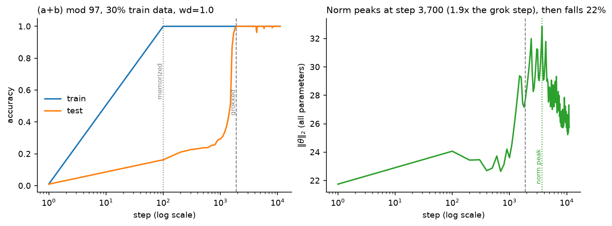

## Problem

Train a 223k-parameter transformer on 30% of all pairs $(a, b)$ to predict
$(a + b) \bmod 97$, supervised at the "=" position of the sequence
$[a, b, =]$. The dataset is noiseless and exhaustive, so test accuracy has an
unambiguous meaning: either the network recovered *the algorithm*, or it
memorized. With ~2.8k training examples against 223k parameters,
memorization is easy — the scientific question is why the network ever
prefers the general solution, and what schedule it finds it on.

The theory ([`theory/notes.md`](theory/notes.md)) covers the attention
derivation, the frequency-space algorithm for modular addition (via the DFT
delta identity $\sum_{k=0}^{p-1} \cos(2\pi k n / p) = p\,\delta_{n \equiv 0}$
and the angle-addition identities), five exercises with worked solutions and
tests, and the norm/efficiency account of *why*
generalization is delayed rather than absent.

## What's implemented

| Piece | Where | Verified how |
|---|---|---|
| Causal multi-head attention, by hand | [`grokking/model.py`](grokking/model.py) | equal to `F.scaled_dot_product_attention` given the same weights; zero attention mass on the future; changing a future token provably cannot change past logits |
| LayerNorm, by hand | [`grokking/model.py`](grokking/model.py) | equal to `F.layer_norm` |
| Modular-addition dataset + splits | [`grokking/data.py`](grokking/data.py) | exhaustiveness, label correctness, disjoint & deterministic splits |
| Full-batch AdamW harness | [`grokking/train.py`](grokking/train.py) | end-to-end memorization sanity run on CPU |
| Sweeps / plots / Fourier analysis | [`experiments/`](experiments/) | all figures regenerate from committed CSV logs |

Design choices that matter for the science: **full batch** (no minibatch
noise confound), **AdamW's decoupled decay** (the regularizer under study —
L2-through-Adam is a different object), **no dropout by default** (so weight
decay is the only regularizer in the main runs — though dropout is an
available knob, used only for the regularizer control in §6), and **two
checkpoints per run** (memorization point
and final) so "before vs after" is a comparison within a single trajectory.

## Results

All runs: $p = 97$, 1 layer, $d_{\text{model}} = 128$, 4 heads, lr $10^{-3}$,
full-batch AdamW. The weight-decay and data-fraction sweeps below run **5 seeds
per cell** and report the median with the min–max range; the mechanistic
single-run analyses (§3–6 and the Fourier/attention/embedding read-outs) stay
on seed 0, which is what the hero figure shows. Logs in [`runs/`](runs/),
regenerate figures with `python experiments/plots.py`.

### 1. Weight decay controls whether — and when — grokking happens

30% training data, three values of weight decay (median grok step over 5 seeds,
`[min–max]`; memorization is at step 100 in every seed):

| weight decay | memorized (100% train) | grokked (99% test), median [range] | delay |
|---|---|---|---|
| 0.0 | step 100 | **never** (25k budget, all 5 seeds) | ∞ |
| 0.1 | step 100 | 10,800 [7,600–13,900] | 108× |
| 1.0 | step 100 | 1,300 [1,200–1,900] | 13× |

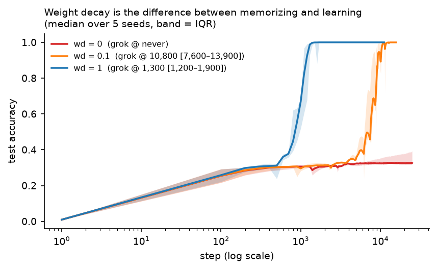

The wd = 0 control memorizes identically fast, then stays memorized — no seed
transitions within budget (final test accuracy 0.29–0.42 across the five, some
implicit regularization but no grok). The seed spread never comes close to
closing the gap between the three cells: even the slowest wd = 1 seed (1,900)
groks before the *fastest* wd = 0.1 seed (7,600), so weight decay's ordering is
not a seed artifact. This is the cleanest evidence in the repo that the delayed
generalization is *driven by the regularizer*, not by more gradient steps on
the task loss: after step ~100 the training loss
is nearly zero and almost all subsequent change in test accuracy is the
norm-pressure term reorganizing the network's internals.

### 2. Less data, longer trance

Weight decay 1.0, four training fractions (median grok step over 5 seeds,
`[min–max]`; 60% is a single-seed context point):

| train fraction | grokked at step, median [range] | delay over memorization |
|---|---|---|
| 25% | 2,700 [2,000–3,100] | 27× |
| 30% | 1,300 [1,200–1,900] | 13× |
| 40% | 300 [300–700] | 3× |
| 60% | 200 (1 seed) | 2× |

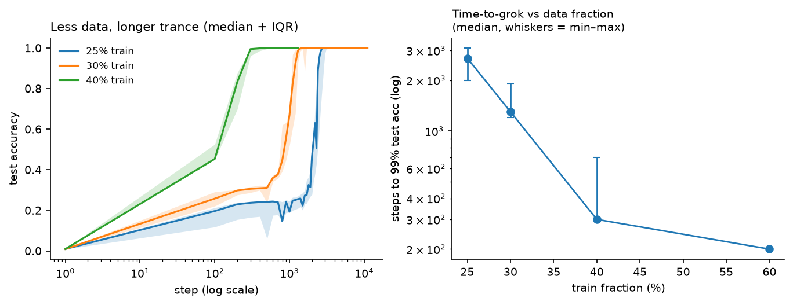

Monotone in the medians, roughly log-linear: as the training set shrinks,
memorization gets
relatively cheaper (fewer pairs to store) while the general circuit's cost is
fixed — so the phase in which memorization dominates stretches. At 60% data
the "delay" nearly vanishes and grokking degenerates into ordinary learning;
grokking is a *small-data* phenomenon.

### 3. Robustness: grokking survives a 10× learning-rate change

Is the grok time an artifact of one tuned learning rate? Rerunning the main
config (30%, wd = 1, seed 0) at lr spanning an order of magnitude
([`lr_sweep.py`](experiments/lr_sweep.py)):

| lr | memorized at | grokked at | delay |
|---|---|---|---|
| 3e-4 | 200 | 5,500 | 27× |
| 1e-3 | 100 | 1,700 | 17× |
| 3e-3 | 100 | 800 | 8× |

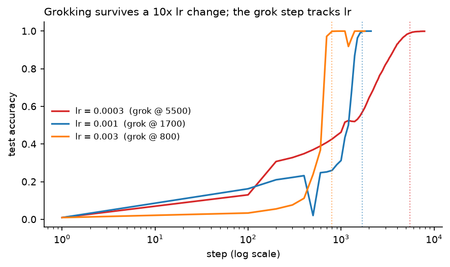

The phenomenon is robust — the network memorizes fast and generalizes late at
every learning rate — but the grok *step* is not a physical constant: it
scales roughly inversely with lr (a 10× larger lr groks ~7× sooner), because
the grok step counts optimizer steps, and a larger step covers more of the
same path per iteration. Memorization is already near-instant at all three
lrs, so the delay multiple shrinks as lr grows while never vanishing. The
takeaway for the rest of this repo: grok steps are only comparable **at fixed
lr** (all other sweeps here hold lr = 1e-3), and "1,900 steps" is a property
of the optimizer schedule, not just the task.

### 4. Does the delay grow with the modulus? (No — data size wins)

Every run above uses $p = 97$. Repeating the main configuration (30%,
wd = 1, seed 0, same lr) at a larger prime $p = 113$ changes two things at
once: more residue classes and Fourier frequencies for the circuit to
represent (harder), but 30% of the larger $p^2$ grid is more absolute
training pairs (easier). [`modulus_scaling.py`](experiments/modulus_scaling.py):

| $p$ | train pairs (30%) | memorized at | grokked at | delay |
|---|---|---|---|---|
| 97 | 2,823 | step 100 | step 1,900 | 19× |
| 113 | 3,831 | step 100 | **step 600** | 6× |

The larger modulus groks **sooner**, not later: memorization is instant in
both, but generalization arrives 3× earlier at $p = 113$. The absolute
training-set size dominates — this is the same lever as §2 (grokking is a
small-data phenomenon), and 3,831 pairs sit further from the critical
fraction than 2,823 do. The transition is also softer at $p = 113$: test
accuracy is already 29% at the memorization point and climbs steadily, rather
than sitting near chance through a long plateau. So "time-to-grok" is not a
clean increasing function of $p$; at fixed data *fraction*, the data-quantity
effect wins on this axis. (One seed, one extra modulus — a direction, not a
scaling law.)

### 5. What changes inside: norm and Fourier structure

Two measurements on the main run (30%, wd = 1), same seed, same trajectory:

- **Weight norm** (right panel of the hero figure): rises while the
  loss-gradient dominates, peaks around the transition, then falls once
  train loss is pinned at ~0 and decay is the only force left. (Our first
  version of this run early-stopped 500 steps after grokking and *missed*
  the decline — the run was extended to 11k steps precisely so the plot
  shows the dynamics rather than an artifact of the stopping rule.)
- **Embedding Fourier spectrum** — the algorithm's fingerprint. At the
  memorization checkpoint, spectral energy is spread across all 48
  frequencies (top-5 share: **13.6%**, indistinguishable from unstructured).
  At the final checkpoint, five frequencies ($k = 5, 14, 20, 36, 37$)
  dominate with a top-5 share of **56.7%**:

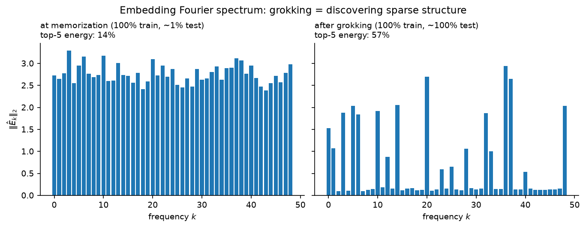

Consistent with Nanda et al.'s progress-measures picture: the general
circuit is sparse in frequency space, and it keeps *consolidating after*
the accuracy jump (our early-stopped checkpoint showed 40%; 3k steps later,
57%) — the "sudden" jump is a thresholding artifact of accuracy, not a
discontinuity in the weights.

### 6. Is it the norm specifically, or any regularizer? (A dropout control)

Section 5 shows weight decay generalizing by pulling the weight norm down, and
the Omnigrok picture (Liu et al. 2023) makes *norm reduction* the mechanism.
That invites a control: swap weight decay for **dropout** — a regularizer that
does not target the norm at all — holding frac = 0.30, seed, and lr fixed
(**dropout 0.1, weight decay 0**).

| regularizer | memorized | grokked | final test acc |
|---|---|---|---|
| none (wd 0) | step 100 | never | 0.29 |
| **dropout 0.1** (wd 0) | step 200 | **step 3500** | **0.999** |
| weight decay 1.0 | step 100 | step 1900 | 1.00 |

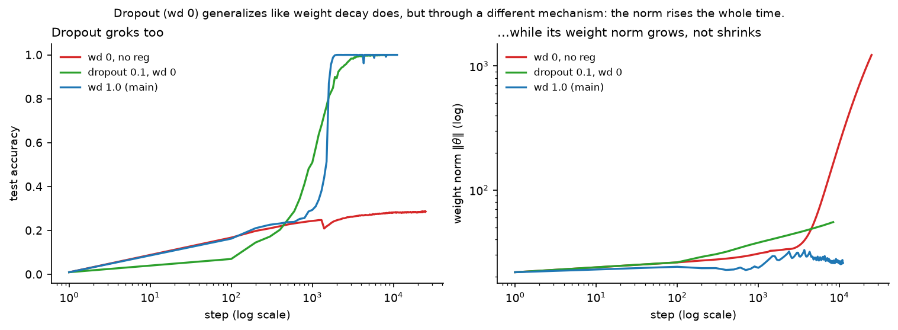

Dropout groks — so it is **not** weight decay specifically that is required.
But the mechanism is visibly different: weight decay generalizes while driving
the norm *down* (section 5), whereas under dropout the norm **rises
monotonically** the entire time (21 → 55) and the model generalizes anyway.
Norm reduction is therefore *sufficient but not necessary* here; a regularizer
that instead penalizes co-adapted, memorization-friendly features reaches the
same generalizing circuit by a different route. What the two share — and what
the unregularized run lacks — is simply *pressure against the pure-memorization
solution*, not a particular way of applying it.

### 7. *Where* does the norm pressure need to be? (Not the embeddings)

Section 6 says pressure against memorization is what matters. But "the weight
norm" is the norm of *every* parameter — so does the decay need to act on the
**embeddings** (the token/position tables, where the Fourier structure lives),
on the **rest** of the network (attention + MLP + unembed, which read that
structure out), or on both at once? This ablation holds the main config fixed
(frac 0.30, wd 1.0, seed 0) and changes only *which* parameters weight decay is
applied to; the untargeted group trains at wd 0.

| weight-decay scope | memorized | grokked (99% test) | final test |
|---|---|---|---|
| decay everything (main) | step 100 | step 1900 | 1.00 |
| decay **non-embeddings only** | step 100 | **step 1800** | 1.00 |
| decay **embeddings only** | step 100 | **never** (15k steps) | 0.36 |

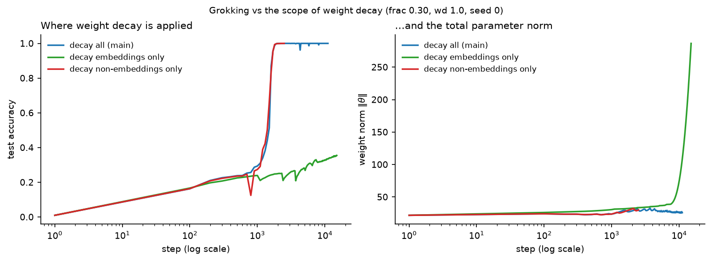

The pressure that matters is on the **non-embedding** weights. Decaying them
alone reproduces the full-decay run almost exactly (grok step 1800 vs 1900, the
two curves overlap). Decaying only the embeddings does essentially nothing: the
model never groks in 15k steps, because the rest of the network — now
unconstrained — keeps its large memorization weights, and the total norm climbs
without bound ($\|\theta\|$ balloons from 21 to **287**, the green curve, while
both grokking runs hold it near 20–40). Weight decay drives grokking by
shrinking the *readout* circuit's parameters; pinning the embeddings' norm is
neither sufficient nor the operative lever. (The embeddings supply the Fourier
basis, but their *scale* is not what memorization exploits.)

### 8. The generalizing solution is a sparse sum over frequencies (logit attribution)

Sections 5–7 look at what grokking does to the *weights*. This one reads the
model's actual **output**. If the network has learned the algorithm, its logits
should (a) depend on $a+b$ and (b) be built from only a few frequencies — the
angle-addition circuit $\text{logit}(a,b,c)\approx\sum_k A_k\cos\big(\tfrac{2\pi
k}{p}(a+b-c)\big)$. Both are directly measurable on the committed checkpoints
([`logit_attribution.py`](experiments/logit_attribution.py)): 2D-Fourier-transform
the logit tensor $L[a,b,c]$ over the two input axes, and a function of $a+b$ puts
all its energy on the diagonal $k_a=k_b$.

| checkpoint | logit energy on the $a{+}b$ diagonal | top **3** frequencies rebuild test acc |
|---|---|---|
| at memorization | **12%** (diffuse) | 0.17 |
| after grokking | **98%** (it computes the sum) | **1.00** |

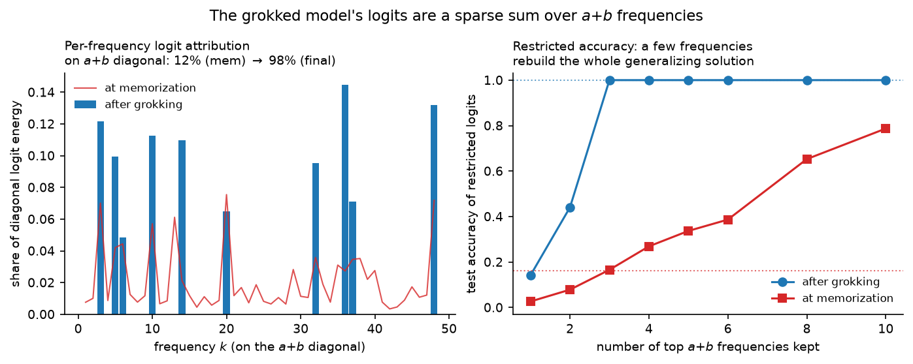

Keeping only the top-$m$ diagonal frequencies and inverse-transforming rebuilds
the logits from *just those frequencies* — a static, hand-built version of Nanda
et al.'s **restricted loss** (§10 makes it a training trajectory). Three frequencies, $k\in\{3,36,48\}$, rebuild the grokked model's
**full 100%** test accuracy. Two further things fall out. The dominant logit
frequencies substantially overlap the dominant *embedding* frequencies (§5) —
the sparse basis the embeddings carry is the basis the logits are written in.
And projecting the **memorization** checkpoint's logits onto the clean $a+b$
subspace recovers far more test accuracy (top-10 freqs → 0.79) than the raw
memorizing model expresses (0.16): the generalizing circuit is already forming,
drowned out by per-pair memorization, *before* the test-accuracy jump — the
same "gradual then sudden" story the progress measures will make quantitative.

### 9. Does grokking need multiple heads? (No — one wide head groks fastest)

The main runs use 4 heads. But modular addition has a single known mechanism —
embed each input on a circle, add the angles, read off the sum by interference
(§8) — and nothing in it obviously needs the representation split across heads.
Holding the main config fixed (frac 0.30, wd 1.0, seed 0) and varying only
`n_heads` with `d_model` pinned at 128 (so head width tracks the count):

| `n_heads` | `d_head` | memorize | grok | final test |
|---|---|---|---|---|
| 1 | 128 | 100 | **400** | 1.000 |
| 2 | 64 | 100 | 900 | 1.000 |
| 4 | 32 | 100 | 1900 | 1.000 |

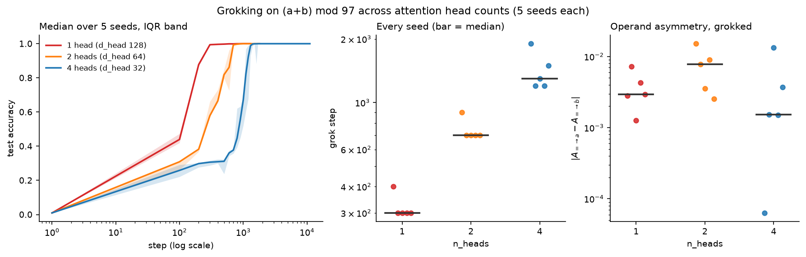

All three grok to 100% — so grokking on this task does **not** require multiple
heads; a single head is enough. And at seed 0 the grok delay *increases*
monotonically with head count: the single wide head (`d_head` 128) forms the
circuit fastest, and splitting the same 128 dimensions into more, narrower heads
slows the transition roughly 2× per doubling. The likely reason is that the
one-head circuit lives in a single attention pattern, while more heads must
coordinate the same computation across a partitioned residual stream. **Caveat**:
this is one seed, and the grok time has real seed spread (the 4-head main run is
1300 [1200–1900] over five seeds, §1); the ~5× span here exceeds that band so the
ordering is likely genuine, but a full multi-seed sweep — not run here — is what
would nail it. Reuses the committed 4-head main run; only the 1-/2-head runs are
computed ([`head_count.py`](experiments/head_count.py)).

### 10. The circuit forms *gradually*, before the jump (progress measures)

Sections 5 and 8 read the Fourier structure of *two* checkpoints (memorization
and final). This section makes it a **trajectory**: rerun the main config with
per-eval instrumentation and log Nanda et al.'s progress measures at every step,
watching the generalizing circuit form continuously under the flat test-accuracy
plateau. The instrumentation is a one-line `on_eval` hook into the trainer that
snapshots the (tiny) model at each eval; the key `a+b` frequencies are then read
off the *final* model (here $k\in\{5,14,20,36,38\}$) and held fixed across the
trajectory, so we track the same circuit forming rather than a moving target.
Two of the measures ablate the logits in the 2D-Fourier basis of §8:

- **restricted loss** — keep *only* those 5 key frequencies of $a+b$;
- **excluded loss** — remove exactly those 5 (all else kept).

Both are computed over all $p^2$ pairs — mechanism measures, decoupled from the
train/test split ([`progress_measures.py`](experiments/progress_measures.py)).

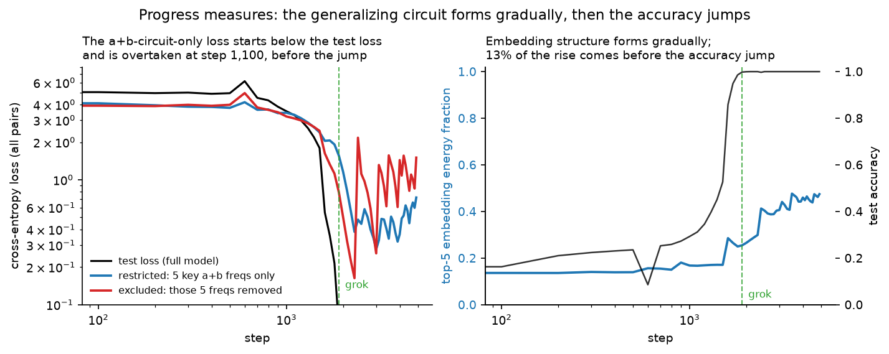

The read-out (main config, seed 0, CPU rerun; grok at ~1900):

- **The generalizing circuit is the better predictor *before* the jump.** At the
  memorization point (step 100), the full model's **test loss is 5.03** yet the
  **restricted loss is 4.10** — projecting onto just the 5 key frequencies is
  already ~0.9 nats *better* than the whole memorizing model, and it keeps
  falling smoothly all through the plateau (to 2.6 by step 1400) while test
  accuracy is still stuck near 15%. The circuit is being built continuously; the
  accuracy jump is when it finally dominates.
- **Embedding structure rises gradually**, from 14% of the spectral energy in
  its top 5 frequencies at memorization to ~47% by the end, beginning to climb
  before the accuracy step (right panel) — the same sparsification §5 sees
  between two checkpoints, now resolved in time.
- **The model genuinely depends on those frequencies.** After grokking the full
  test loss reaches ~$10^{-2}$, but the *excluded* loss stays near 1 — remove the
  5 key frequencies and the solution collapses.

This is the quantitative version of §8's static hint ("the circuit is already
forming under the memorization, before the test-accuracy jump"). Because the
trajectory CSV is committed, the figure reproduces with no retraining.

### 11. Other operations: is it addition, or the group structure? (Subtraction and multiplication)

Everything above is (a+b) mod 97. Two other binary operations on the same digit
vocabulary test whether grokking is about *addition* specifically or about the
underlying **group** the network has to discover:

- **(a−b) mod 97** is still the additive group Z/97 — negating the second
  operand is just a relabelling of the answer, so the §8 Fourier-addition
  circuit transfers unchanged. Same group, same predicted mechanism.
- **(a×b) mod 97** is the interesting one. On the *nonzero* residues it is the
  cyclic **multiplicative** group (Z/97)ˣ of order p−1 = 96, and the discrete
  logarithm to a primitive root g (a = gⁱ, b = gʲ ⇒ a·b = g^((i+j) mod 96))
  makes it *isomorphic to addition mod 96*. So multiplication should grok too —
  it is addition in disguise — but in a 96-element group, with the 2p−1 = 193
  pairs that involve a 0 (product 0) sitting outside the group as a trivial
  constant the network can only memorize.

Holding the main config fixed (frac 0.30) and sweeping the operation at strong
and weak weight decay, **three seeds per cell**:

| operation | answer group | wd | grok step, median [min–max] | final test |
|---|---|---|---|---|
| (a+b) mod 97 | Z/97 (order 97) | 1.0 | 1,300 [1,200–1,900] | 1.000 |
| (a−b) mod 97 | Z/97 (order 97) | 1.0 | 3,700 [2,500–3,900] | 1.000 |
| (a×b) mod 97 | (Z/97)ˣ (order 96) | 1.0 | 1,100 [1,000–1,500] | 1.000 |
| (a+b) mod 97 | Z/97 (order 97) | 0.1 | 10,800 [9,200–13,900] | 1.000 |
| (a−b) mod 97 | Z/97 (order 97) | 0.1 | **24,800 (1 of 3 seeds)** | 0.148 / 0.047 / 0.962 |
| (a×b) mod 97 | (Z/97)ˣ (order 96) | 0.1 | 8,400 [7,900–11,900] | 1.000 |

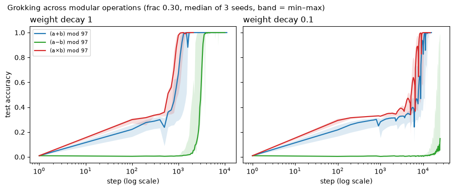

- **All three grok at strong weight decay, in every seed** — delayed
  generalization is not specific to addition; it appears for any of these group
  operations, and each still memorizes at step 100 first.
- **Subtraction is decisively the slowest, and the seeds agree.** At wd 1.0 its
  range [2,500–3,900] does not overlap addition's [1,200–1,900] or
  multiplication's [1,000–1,500] at all, so this is a real gap and not seed
  noise. At wd 0.1 it becomes a *qualitative* difference: two of three seeds
  never grok inside the 25k-step budget (final test 0.148 and 0.047) and the
  third only makes it at step 24,800, right at the edge.
- **Multiplication is not measurably faster than addition** — and this
  **corrects the earlier single-seed reading**. Seed 0 alone showed mul 1,000 vs
  add 1,900 and invited the story that the highly composite group order 96 =
  2⁵·3 gives the circuit more low-order frequencies to latch onto. With three
  seeds the medians are 1,100 vs 1,300 and the ranges overlap almost entirely,
  so the honest statement is that mul ≈ add. (At wd 0.1 mul is lower in every
  order statistic — 8,400 [7,900–11,900] vs 10,800 [9,200–13,900] — but the
  ranges still overlap, so at most a weak effect.) The isomorphism argument
  survives as an explanation of *why multiplication groks at all*; it does not
  survive as an explanation of it grokking sooner.
- **So the group is not what separates these tasks.** Subtraction has the
  *identical* group to addition and is reliably the hardest of the three, so
  group order and structure cannot be the operative variable. The one structural
  property that distinguishes it: **a−b is the only non-commutative operation
  here**, and the appendix's attention read-out shows grokking *symmetrizes* how
  the "=" position reads the two operands (per-head |A[=→a] − A[=→b]| falls
  0.19 → 0.00). A commutative target lets that symmetric circuit serve; a
  non-commutative one forbids it. **That hypothesis is now tested** — on the
  subtraction checkpoints, below.
- **Three seeds is not a distribution**, the same caveat as the wd/frac bands in
  §3. The claims above are stated at the resolution the ranges support:
  disjoint ranges (sub vs the rest) treated as real, overlapping ones (mul vs
  add) treated as unresolved.

Only the sub/mul runs are computed; the addition rows reuse the committed
multi-seed sweep CSVs ([`operations.py`](experiments/operations.py)).

#### Testing the commutativity hypothesis (`experiments/swap_equivariance.py`)

The hypothesis above needs a control, because "grokking symmetrizes the operand
read" could just as easily be a fact about *grokking* as a fact about
commutativity — and the read-out had only ever been run on addition. So run it
on subtraction, where the task forbids the symmetry.

One thing has to be right first. Demanding $L(a,b) = L(b,a)$ of a subtraction
model is demanding that it be **wrong**, so a defect there would show nothing.
What $a - b = -(b-a)$ licenses instead is *anti*-equivariance: swapping the
operands negates the answer, so the logit vector should come back permuted by
$c \mapsto -c \bmod p$. Both statistics are computed for both operations, each
normalized by the logits' own sd, against a **shuffle baseline** of 1.11 — the
level a defect reads when each input is paired with a random other input, i.e.
when there is no symmetry to find.

| $wd = 1$, 3 seeds | invariance $L(a,b)$ vs $L(b,a)$ | anti-equivariance $L(a,b)$ vs $L(b,a)[-c]$ |
|---|---|---|
| add, memorized | 0.560 &nbsp;[0.50, 0.61] | 1.108 &nbsp;[1.11, 1.13] |
| add, grokked | **0.010** &nbsp;[0.00, 0.03] | 1.076 &nbsp;[1.04, 1.11] |
| sub, memorized | 0.807 &nbsp;[0.80, 0.83] | 1.034 &nbsp;[1.03, 1.06] |
| sub, grokked | 1.086 &nbsp;[1.04, 1.09] | **0.271** &nbsp;[0.15, 0.51] |

**Grokking does not buy commutativity. It buys whichever swap symmetry the
operation actually has.** Addition's invariance defect collapses to 0.010 while
the symmetry it does *not* have stays pinned at the no-symmetry level.
Subtraction goes the other way in both columns: its invariance defect *rises*
to 1.086, essentially the shuffle baseline — it has to order its operands, and
grokking makes it better at that, not worse — while the symmetry it is allowed
falls 3.8×. §11's own attention statistic agrees, 0.148 → 0.002 for addition
against 0.324 → 0.465 for subtraction. The commutativity hypothesis survives
the control.

Two things that do not fit the clean story, and belong here rather than in a
footnote:

- **Subtraction's symmetry is acquired far less completely.** 0.271 against
  addition's 0.010 is 27×, and its seed spread (0.15–0.51, a factor of 3.4)
  against addition's 0.00–0.03 says it is not even a stable quantity. Whatever
  the subtraction model is doing, it is not the tidy exact symmetry the
  addition model reaches — which is at least consistent with subtraction being
  the slowest of the three to grok, though this does not show that it is why.
- **At $wd = 0.1$ only one subtraction seed of three generalized at all** (the
  same as §11 measured), so that cell is a single run, not a median, and it is
  filtered and labelled as one. Its anti-equivariance defect is 0.553; the two
  failed seeds sit at 0.86 and 0.97, near the no-symmetry level, which is what
  a run that never found the structure should look like.

<p align="center">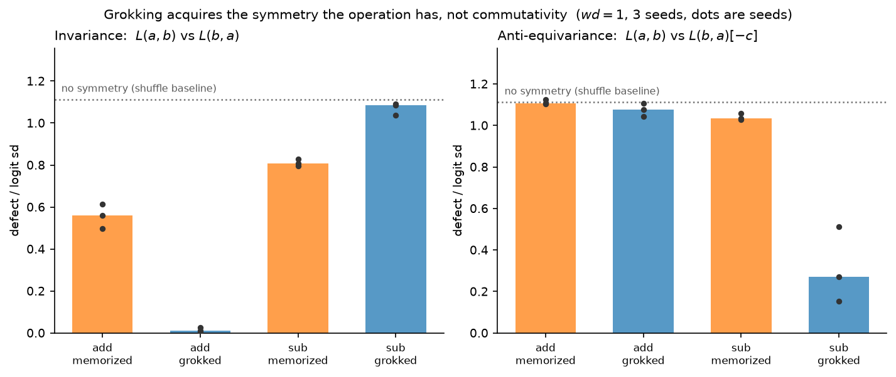</p>

The sweep's checkpoints are not committed (`.gitignore` keeps `.pt` files out),
so the read-outs are committed instead as a 3 KB CSV and the figure replays
from that; a test re-measures the one run whose weights *are* in the repo and
requires the CSV to match it.

### Appendix: attention and embedding geometry

The same before/after story is visible in two more read-outs of the
committed checkpoints (both regenerated by `reproduce_figures.py`, no
retraining):

- **Attention pattern** ([`attention_pattern.py`](experiments/attention_pattern.py)).
  The "=" token — where the answer is written — spends most of its attention
  on the two operand positions `a` and `b` (the causal mask forbids looking
  ahead), but not equally so in the two checkpoints: **99.7%** at memorization
  against **83.7%** after grokking, the rest returning to the "=" position
  itself. That difference is not a leak; the entropy read-out below takes it
  apart. What grokking changes is the *symmetry*: the grokked heads split
  their operand
  attention almost exactly evenly (per-head $|A_{=\to a} - A_{=\to b}|$ falls
  from **0.19** to **0.00**), matching the commutativity $a + b = b + a$ that
  the general algorithm must respect, whereas the memorizing heads are
  lopsided (one puts 0.74 on `a`, 0.25 on `b`).

  That statistic is averaged over the dataset, and Exercise 3 of
  [`theory/notes.md`](theory/notes.md) works out what averaging makes it mean:
  since the dataset is every *ordered* pair, the per-example difference is odd
  under swapping the operands exactly when the computation is
  swap-equivariant, so the dataset mean measures equivariance and not
  per-input symmetry. The grokked model is in fact still strongly asymmetric
  on individual inputs (per-example $\mathbb{E}|A_{=\to a} - A_{=\to b}| =
  0.15$, eight times its value at initialization) — it has learned the
  *symmetry*, not a uniform read. Measured directly, the equivariance defect
  $\mathbb{E}|A_{(a,b) \to a} - A_{(b,a) \to b}|$ is 0.189 at memorization and
  0.00017 after grokking, and it reaches the output: swapping the operands
  moves the memorizing model's logits by 0.61 of their own standard deviation,
  against 0.004 for the grokked one. The memorizing model computes a
  materially non-commutative function; the grokked one does not.

  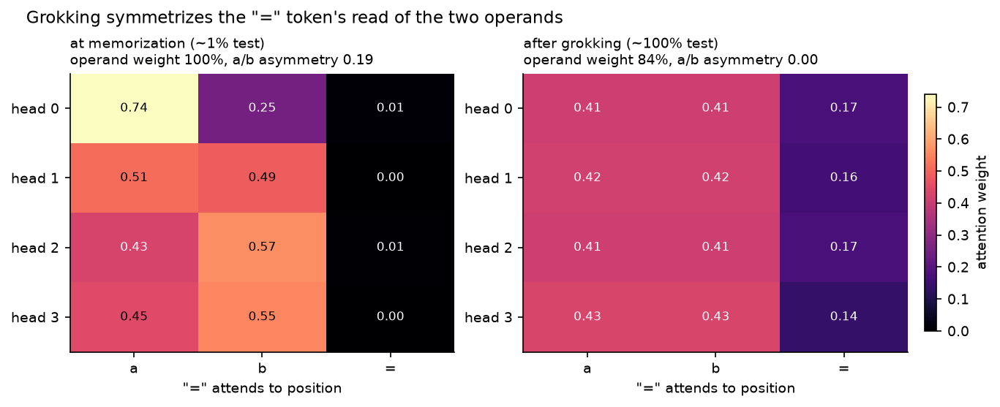

- **Attention entropy along the trajectory**
  ([`attention_entropy.py`](experiments/attention_entropy.py)). The read-out
  above is two checkpoints; this is the same statistics at every eval step, and
  the path has two regimes the endpoints cannot show. Entropies are in nats,
  with $\ln 3 = 1.099$ (flat over the three positions) and $\ln 2 = 0.693$
  (half on `a`, half on `b`, none on `=`) as the reference levels.

  | | init | memorization | grok step | end of run |
  |---|---|---|---|---|
  | full `"="` row entropy | 1.098 | 0.677 | 0.826 | 0.935 |
  | operands only, renormalized | 0.6931 | 0.658 | 0.686 | 0.6931 |
  | operand weight | 0.673 | 0.997 | 0.960 | 0.909 |
  | per-head $\lvert A_{=\to a} - A_{=\to b}\rvert$ | 0.004 | 0.189 | 0.083 | 0.0004 |

  Read the second row first. **A randomly initialized model is already at the
  algorithmic symmetry** ($\ln 2$, exactly — a near-uniform softmax is
  commutative for free). Memorization *destroys* it, driving the operand
  entropy down to 0.658 and the per-head asymmetry from 0.004 to 0.189 while
  concentrating 99.7% of the row onto the operands. Grokking then puts it back,
  to $\ln 2$ to five decimals on every head. The model does not learn
  commutativity so much as recover it.

  The first row is the same trajectory read through the usual "attention
  sharpens" lens, and that lens is wrong twice over here: entropy *rises*
  through grokking (0.677 → 0.935), because commutativity makes an even operand
  split correct rather than sloppy, and because after the jump a self-attention
  channel opens — the operand weight falls to 0.83–0.98 and fluctuates from eval
  to eval. That channel carries no information: position 2 is the `=` token in
  every example, so the value vector the `=` query pulls from itself has an
  across-batch standard deviation of exactly zero. It is a learned bias, and
  dividing it out is what the second row does.

  What this does **not** show, since it was the motivating question: the
  symmetry is restored at step 2300, *after* test accuracy passes 0.5 (1500) and
  after the grok step (1900). Unlike §10's restricted loss, this read-out is a
  lagging indicator, not an early warning. Seed 0 only, like the other
  mechanistic read-outs pending
  [issue #4](https://github.com/porth-bot/grokking-transformer/issues/4). The
  instrumented rerun stops on patience near step 4500, so its last column is not
  the 25000-step checkpoint the row above uses (0.935 vs 1.024 nats, 0.909 vs
  0.837 operand weight) — both sit inside the post-grok fluctuation band, which
  is the point.

  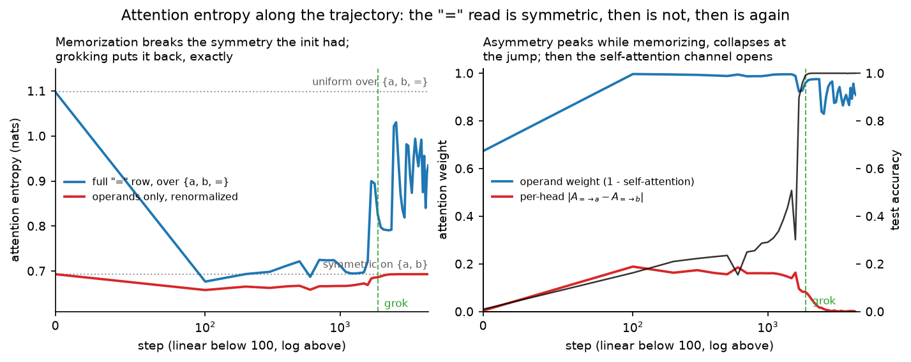

- **Embedding ring** ([`embedding_circle.py`](experiments/embedding_circle.py)).
  Projected onto the dominant frequency's (cos, sin) plane, the grokked digit
  embeddings trace a clean circle (radial CV 0.13, up from a diffuse 0.41 at
  memorization) — the geometric face of the Fourier sparsification above.

  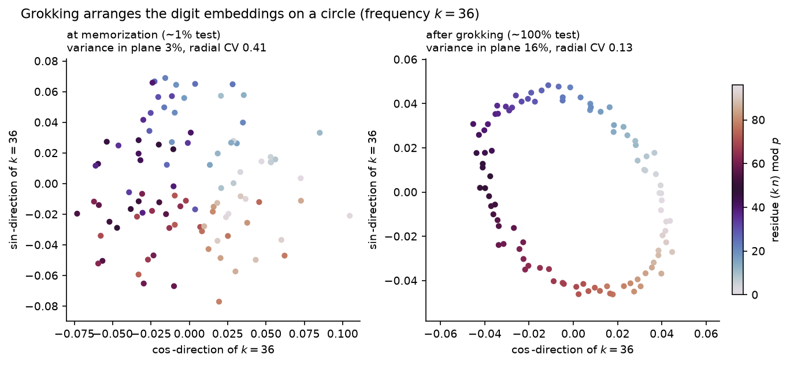

## Reproduce

Every figure, from a clean clone, without training anything:

```bash
python -m venv .venv && source .venv/bin/activate
pip install -r requirements.txt && pip install -e .
./reproduce.sh                      # tests, mypy, all 14 figures: ~25 s
```

`requirements.txt` pins the exact versions the committed runs were produced
with (Python 3.12.13, torch 2.12.1); `pyproject.toml` keeps lower bounds
instead, which is what CI installs. The replay is pure post-processing of
committed files, so it is exact: every PNG comes back byte-for-byte. Training
itself is seeded and replays on the same torch build, but torch guarantees no
bitwise determinism across versions or hardware — which is exactly why the runs
are committed rather than regenerated on demand.

To retrain instead (hours, not seconds). Every experiment script is listed, and
the training costs are the wall-clock the committed run logs actually recorded
(`wall_seconds` in `runs*/`, Apple Silicon MPS) rather than estimates:

```bash
pytest                              # 79 tests
python experiments/run_sweep.py     # §1-2 26 runs (5 seeds x 5 cells + 1), 2.6 h — resumable
python experiments/lr_sweep.py      # §3 learning-rate robustness (3 runs, 4.5 min)
python experiments/modulus_scaling.py  # §4 p = 113 (1 run, 45 s; p = 97 reuses the sweep)
python experiments/fourier.py          # §5 Fourier spectrum (checkpoints only, no training)
python experiments/dropout_control.py  # §6 regularizer control (1 run, 3.7 min)
python experiments/wd_scope.py         # §7 weight-decay scope ablation (2 runs, 7.2 min; reuses the main baseline)
python experiments/logit_attribution.py  # §8 per-frequency logit attribution (checkpoints only)
python experiments/head_count.py         # §9 1 vs 2 vs 4 heads (2 runs, 1 min; 4 heads is the main run)
python experiments/progress_measures.py  # §10 trajectory of progress measures (reruns the main config, ~6 min CPU)
python experiments/operations.py         # §11 subtraction/multiplication vs addition (12 runs, 55 min; addition reuses the sweep CSVs)
python experiments/embedding_circle.py   # appendix: embedding ring (checkpoints only)
python experiments/attention_pattern.py  # appendix: attention symmetry (checkpoints only)
python experiments/attention_entropy.py  # appendix: attention entropy trajectory (reruns the main config, ~3 min CPU)
python experiments/plots.py              # §1-2 figures from committed CSVs (no training needed)
python experiments/reproduce_figures.py  # every figure from committed logs, no training
```

The four checkpoint-only scripts and `plots.py` need no GPU and no training at
all — they are the replay path, and `reproduce_figures.py` runs all of them.

Committed CSV logs mean the figures are reproducible without retraining. Model
checkpoints are gitignored *except* the two from the main run
(`p97_frac0.30_wd1_seed0{,_memorize}.pt`, ~0.9 MB each), which the mechanistic
figures — Fourier spectrum, embedding ring, attention pattern, logit
attribution — are drawn from, so those reproduce from a clone too.
`tests/test_reproduce_figures.py` asserts that every figure in `figures/` has a
replay path and that every artifact the replay reads is committed.

## Honest limitations

- **Five seeds, not a distribution.** The wd and frac sweeps now carry
  min–max ranges over 5 seeds (§1–2), enough to show the between-cell gaps
  survive seed noise but too few to trust the range as a real spread — treat
  it as a rough error bar, not a confidence interval. The *mechanistic*
  read-outs (Fourier spectrum, attention, embedding ring, §5 and appendix)
  are still single-run (seed 0); their qualitative claims are not yet
  seed-averaged.
- **Architecture differs from Nanda et al.** (we use LayerNorm + GELU;
  their interp model was LN-free ReLU), which is likely part of why our
  final spectrum is sparse-but-not-extremely-sparse rather than >90%
  concentrated. Training far past the transition sharpens it.
- **Thresholds are conventions** (99.9% "memorized", 99% "grokked"); the
  underlying weight-space transition is gradual.

## Next

- wd × frac interaction surface (a coarse 2D grid); seed-averaged versions of
  the mechanistic read-outs.
- Division (the multiplicative-group inverse, undefined at $b=0$) as the next
  comparative operation — and the one whose swap symmetry is a third case
  again, since $a/b$ and $b/a$ are reciprocals rather than negations.
- Why subtraction's acquired symmetry is 27× looser than addition's and swings
  by 3.4× across seeds (§11). The measurement is there; the explanation is not,
  and "it is the hardest operation" restates it rather than accounting for it.

## References

Power et al. (2022) arXiv:2201.02177 (grokking); Nanda et al. (2023) ICLR,
arXiv:2301.05217 (Fourier circuit, progress measures); Liu et al. (2023)
"Omnigrok", ICLR (norm dynamics); Varma et al. (2023) arXiv:2309.02390
(circuit efficiency); Vaswani et al. (2017) (transformer); Loshchilov &
Hutter (2019) (AdamW). Roles and derivations in
[`theory/notes.md`](theory/notes.md).

## Part of a from-scratch series

Same bar in each: the core written out by hand, every non-obvious claim checked
against a closed form or an independent oracle, limitations stated rather than
buried.

| Repo | Built from scratch |
| --- | --- |
| **grokking-transformer** *(this repo)* | A transformer that groks modular arithmetic, and the Fourier circuit it learns |
| [mcmc-from-scratch](https://github.com/porth-bot/mcmc-from-scratch) | Metropolis-Hastings, Gibbs, HMC, MALA, NUTS, parallel tempering — validated against exact posteriors |
| [gp-from-scratch](https://github.com/porth-bot/gp-from-scratch) | GP regression, kernels with hand-derived gradients, ML-II, and the NTK/NNGP wide-network correspondence |
| [pinn-from-scratch](https://github.com/porth-bot/pinn-from-scratch) | Physics-informed networks: exact autograd PDE residuals against closed-form solutions |
| [diffusion-from-scratch](https://github.com/porth-bot/diffusion-from-scratch) | Score matching, reverse-time samplers, and the probability-flow ODE — against exact scores at every noise level |

The nearest neighbour is pinn-from-scratch, and for a reason that goes past
both being PyTorch: both read a trained network in the frequency domain, and
both find the story is in the *trajectory* rather than the endpoint. Here the
angle-addition circuit is already forming underneath the memorization, before
the test accuracy moves (§8: restricting the memorizing model's logits to the
$a+b$ subspace recovers 0.79 accuracy where the raw model gets 0.16). There,
low frequencies are fit first and high ones lag by an order of magnitude per
octave — with the same caveat that the ordering is invisible if you only look
at the converged model. The NTK machinery behind that argument is derived from
scratch in gp-from-scratch §6–7.

## Provenance

Built as a study resource, with the theory written out in
[`theory/notes.md`](theory/notes.md)
and every structural claim about the implementation pinned by a test.
MIT license.

*Suggested GitHub topics:* `grokking` `transformer` `mechanistic-interpretability`
`deep-learning` `pytorch` `from-scratch` `attention`
